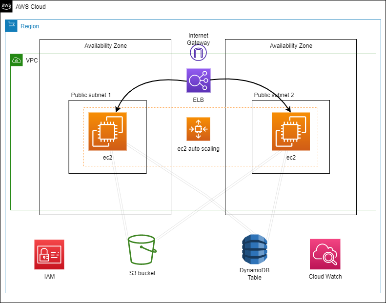

# Employee-dir Flask App

 

### This application is entirely hosted on aws which ensures high availability & auto scaling

 
 

# Visual Diagram

## aws components used

-   EC2
-   EC2 auto-scaling
-   EC2 ELB (Elastic load balancer)
-   S3 bucket
-   DynamoDB
-   VPC
-   Two Availability zones
-   Two public subnets
-   Internet Gateway
-   IAM
-   Cloud Watch

 

### Follow the below steps to create above architecture.

- step-1 : [Create aws account 🖇️](https://aws-tc-largeobjects.s3-us-west-2.amazonaws.com/DEV-AWS-MO-GCNv2/exercise-1-account.html)

- step-2 : [Configure IAM 🖇️](https://aws-tc-largeobjects.s3-us-west-2.amazonaws.com/DEV-AWS-MO-GCNv2/exercise-2-iam.html)

- step-3 : [Launch EC2 instance 🖇️](https://aws-tc-largeobjects.s3-us-west-2.amazonaws.com/DEV-AWS-MO-GCNv2/exercise-2-iam.html)

- step-4 : [Setup VPC 🖇️](https://aws-tc-largeobjects.s3-us-west-2.amazonaws.com/DEV-AWS-MO-GCNv2/exercise-4-networking.html)

- step-5 : [Create S3 bucket & modify EC2 instance 🖇️](https://aws-tc-largeobjects.s3-us-west-2.amazonaws.com/DEV-AWS-MO-GCNv2/exercise-5-storage.html)

- step-6 : [Setup the database (DynamoDB) 🖇️](https://aws-tc-largeobjects.s3-us-west-2.amazonaws.com/DEV-AWS-MO-GCNv2/exercise-6-databases.html)

- setp-7 : [Configure auto-scaling & load balancing 🖇️](https://aws-tc-largeobjects.s3.us-west-2.amazonaws.com/DEV-AWS-MO-GCNv2/exercise-7-elb.html)

 

